

# 크루위키 (Crew-Wiki)

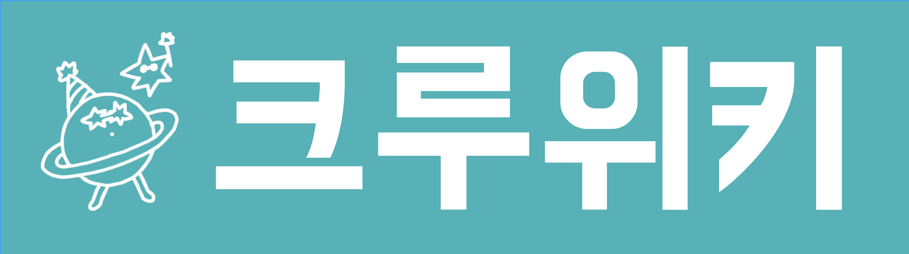

### 우아한테크코스 크루들을 위한 위키 서비스
크루들의 정보(논란)를 기록하고 공유하는 공간입니다.

### [🔗 크루위키](https://www.crew-wiki.site/)

## 기술 스택

## 주요 기능

### 문서 조회

문서를 조회할 수 있습니다.  
H1, H2, H3 태그를 인식해서 목차가 자동으로 생성되며, 목차를 누르면 해당 제목으로 이동합니다.

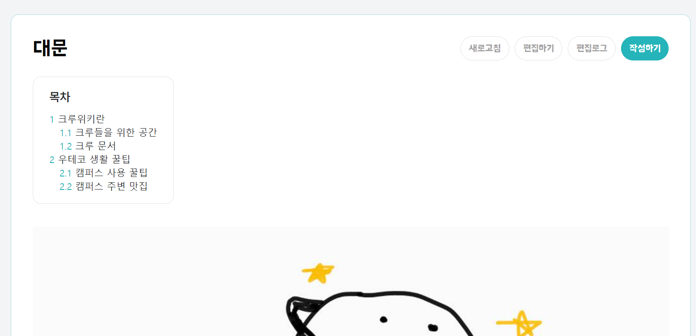

- **새로고침** - 새로고침 버튼을 누르면 최신 문서 상태를 불러옵니다.
- **편집하기** - 편집 버튼을 눌러 문서를 수정할 수 있습니다.
- **편집기록** - 이전 버전의 문서 내용을 확인할 수 있습니다.
- **작성하기** - 새 문서를 등록할 수 있습니다.

### 문서 편집

문서를 편집할 수 있습니다.  
제목은 편집할 수 없으며, 편집자와 내용을 입력하면 작성완료 버튼이 활성화됩니다.
편집 중 실수로 이탈했을 때를 대비해 문서가 5초마다 세션 스토리지에 자동 저장됩니다.

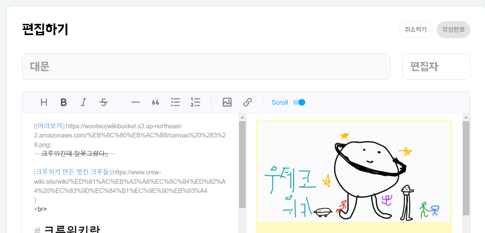

### 문서 작성

새로운 문서를 작성할 수 있습니다.  
이미 존재하는 제목의 문서는 등록할 수 없으며, 제목 입력 후 포커스를 해제하면 중복 여부를 자동으로 검사합니다.
문서 제목과 편집자, 내용을 입력하면 작성완료 버튼이 활성화됩니다. 
작성 중에도 5초마다 세션 스토리지에 자동 저장됩니다.

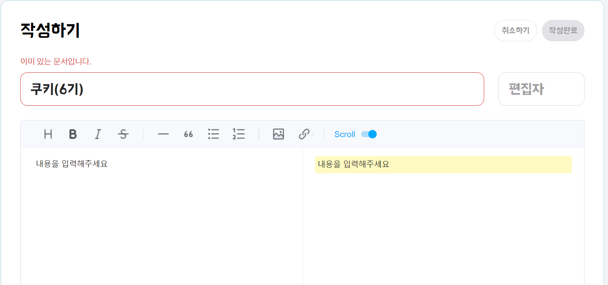

### 편집기록

문서의 편집기록을 확인할 수 있습니다.  
버전, 생성일시, 문서 크기, 편집자를 확인할 수 있습니다.
누구나 수정 가능하기 때문에 편집자를 양심있게 적어주셔야 합니다.

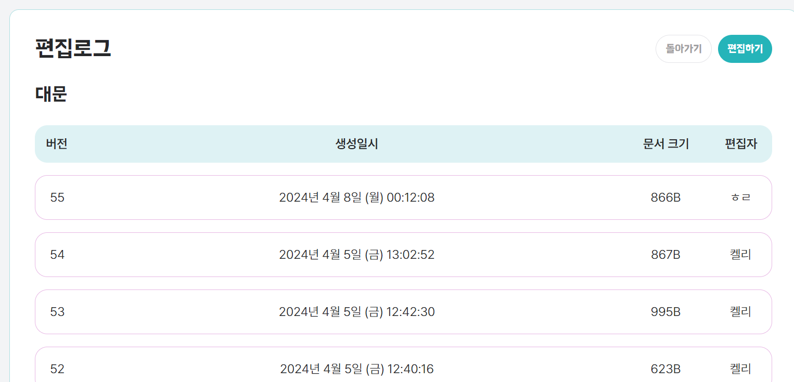

### 문서 검색

검색창에서 문서 제목을 입력하면 **자동완성 기능**을 통해 빠르게 문서를 찾을 수 있습니다.

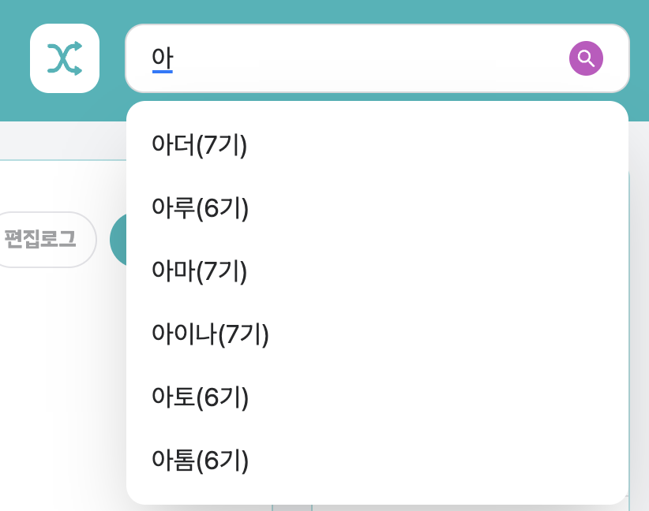

### 최근 편집

최근에 편집된 문서 20개를 확인할 수 있습니다. 데스크톱 화면에서 사이드바로 표시됩니다.

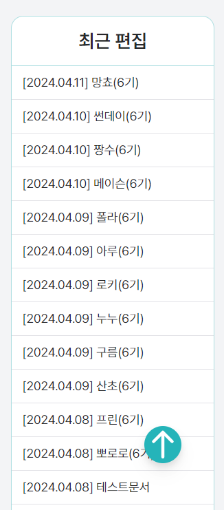

### 랜덤 문서 조회

헤더의 랜덤 버튼을 누르면 등록된 문서 중 하나를 랜덤으로 보여줍니다.

### 조직 문서

크루 문서의 작성하기 또는 편집하기 페이지에서 조직을 추가할 수 있습니다.  
신규 조직을 추가하고 작성완료 버튼을 누르면 해당 조직의 문서가 자동으로 생성됩니다.

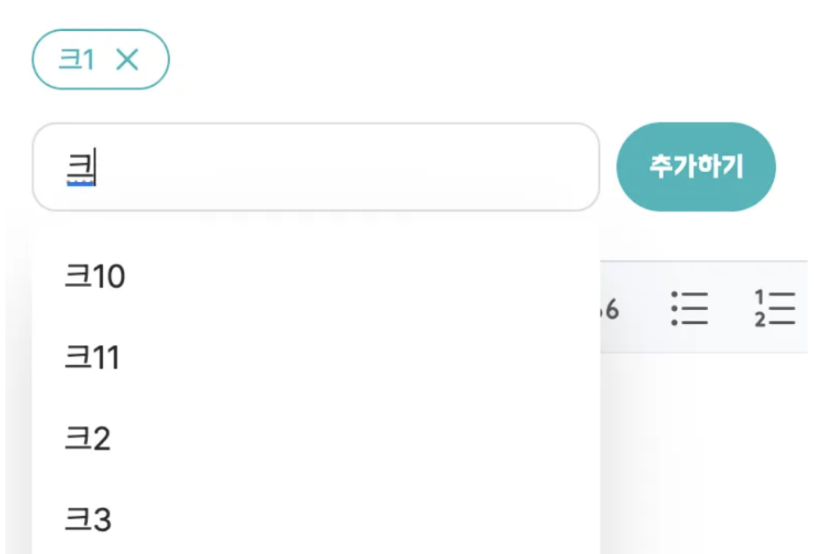

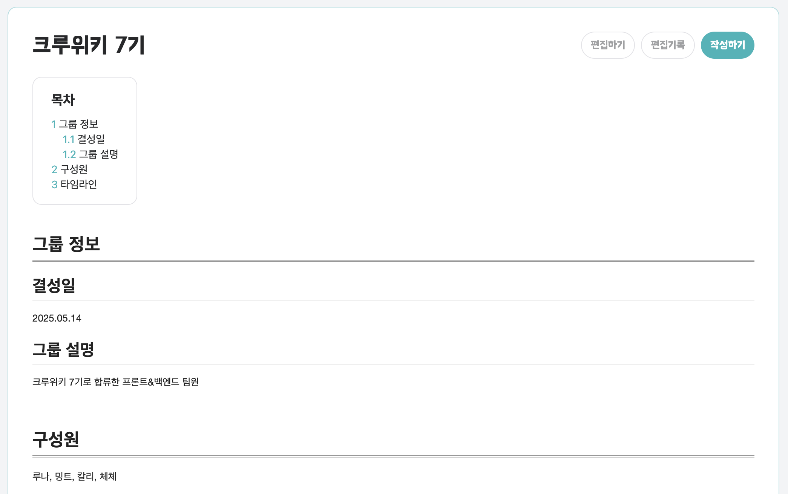

- **조직 추가** - 새로운 조직은 '추가하기'로 등록하고, 이미 존재하는 조직은 드롭다운에서 선택합니다.
- **등록 취소** - Chip의 X 버튼으로 조직 등록을 취소할 수 있습니다.
- **조직 문서** - 일반 문서와 마찬가지로 내용 수정, 편집기록 조회가 가능하고, 타임라인에 이벤트를 등록할 수 있습니다.

### 타임라인

조직의 주요 이벤트를 타임라인 형태로 볼 수 있습니다.  
이벤트 추가 버튼을 눌러 정보(날짜, 제목, 작성자, 내용)를 입력하고 추가하면 타임라인에 이벤트가 등록됩니다.

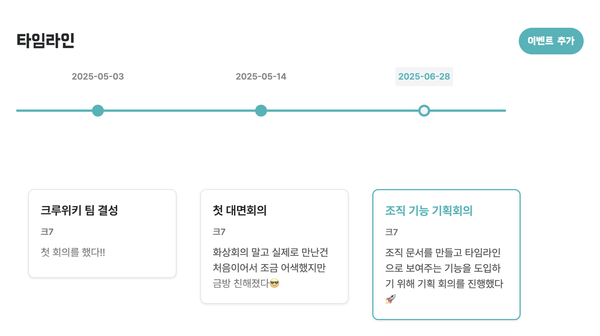

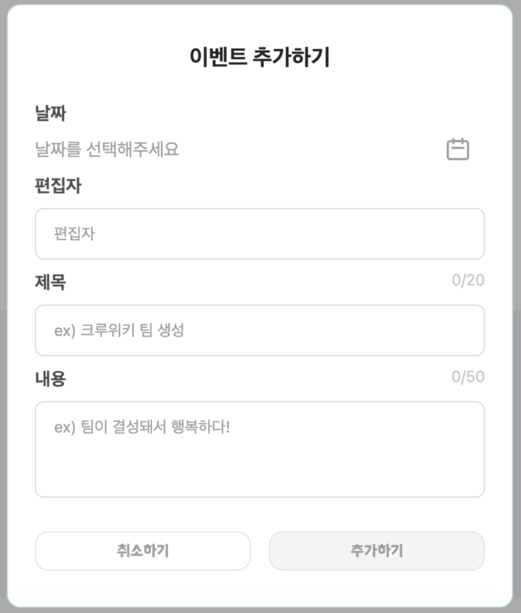

## Team

### Frontend

<table>
  <tr>
    <td align="center"> <a href="https://github.com/jinhokim98">쿠키</a> 6기</td>
    <td align="center"> <a href="https://github.com/Todari">토다리</a> 6기</td>
    <td align="center"> <a href="https://github.com/chosim-dvlpr">프룬</a> 6기</td>
    <td align="center"> <a href="https://github.com/ShinjungOh">루나</a> 7기</td>
  </tr>
</table>

### Backend

<table>
  <tr>
    <td align="center"> <a href="https://github.com/Minjoo522">리브</a> 6기</td>
    <td align="center"> <a href="https://github.com/masonkimseoul">메이슨</a> 6기</td>
    <td align="center"> <a href="https://github.com/jinchiim">폴라</a> 6기</td>
    <td align="center"> <a href="https://github.com/Starlight258">밍트</a> 7기</td>
    <td align="center"> <a href="https://github.com/2Jin1031">칼리</a> 7기</td>
    <td align="center"> <a href="https://github.com/CheChe903">체체</a> 7기</td>
  </tr>
</table>
